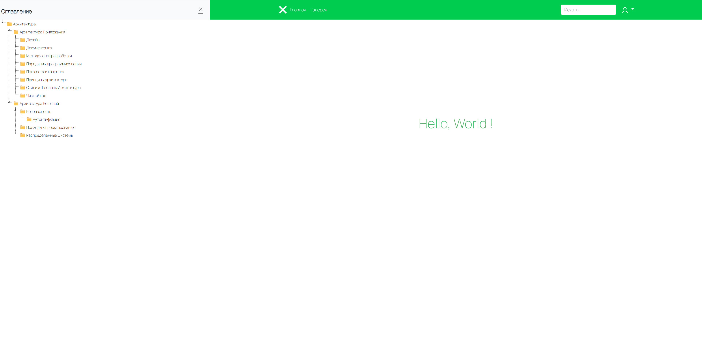
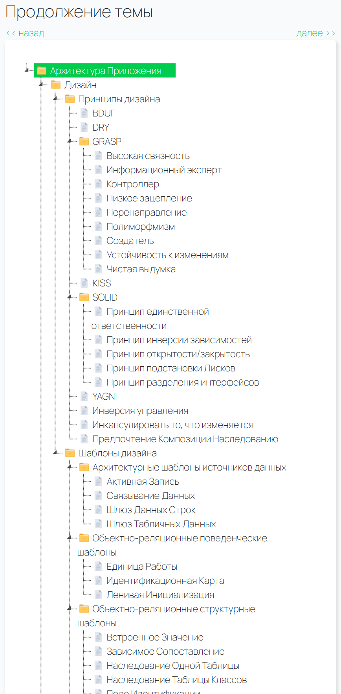
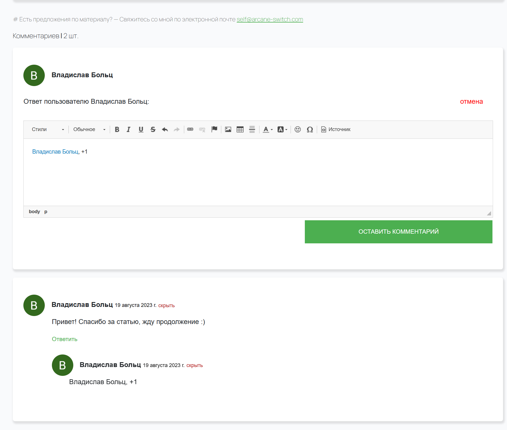
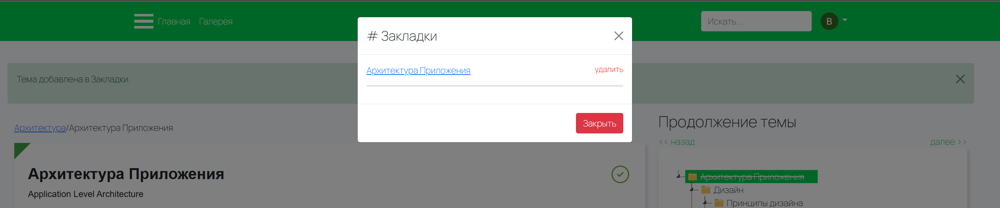
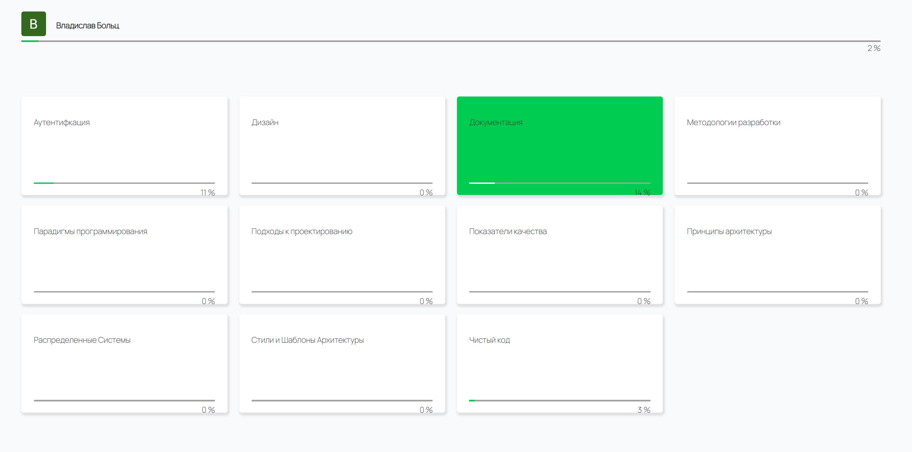
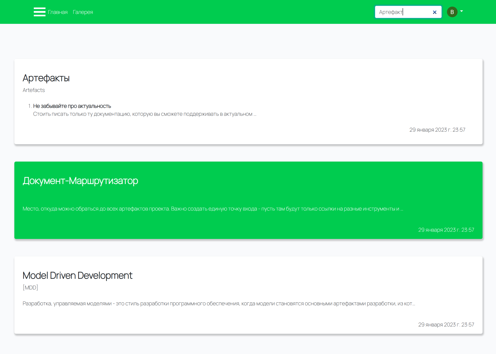
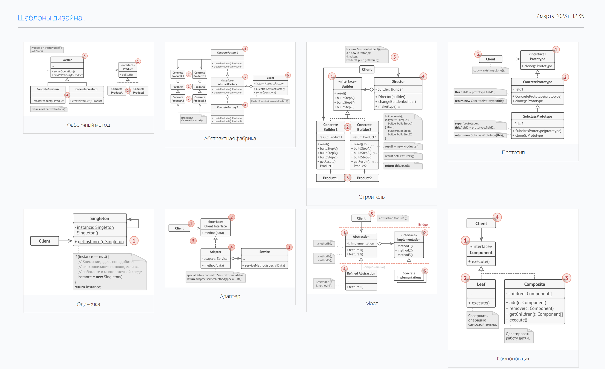

# The blog about IT architecture <https://arcane-switch.com>

# Features
- ### Navigate via **Tree-based** topics catalog (**Drill down** navigation: next, previous)

- ### Leave **Comments and Replies**

- ### Create **Bookmarks**

- ### **Track learning** progress by high-level topics

- ### **Search topics**

- ### **Explore Templates** gallery

- ### Nested **django-admin** topics creation and edition
  - Move topic by hierarchy via **drag and drop** mechanism
  - Markdown syntax support
  - Admin-themes customization

> NO AUTH (or only Google)  
> NO PAYMENTS

# Dependencies
- min Django 4.*
- min Python 3.11
- gunicorn
- nginx
- docker
- docker-compose
- tasks
